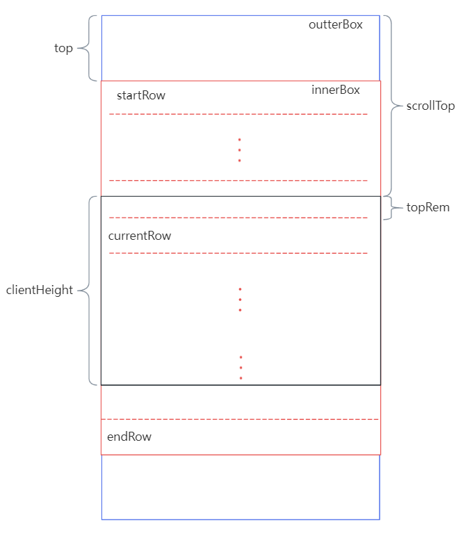

# 说明

该库是一个虚拟滚动的纯 js 计算模型，可以根据滚动偏移计算当前应该显示的列表范围，最终作为 UI 渲染框架的输入。

基本原理：

<div>
    
</div>

示例：

```js
// base example
var vsb = new VirtualScrollBounding({
    list: lsitData, // 实际数据
    minRowHeight: 30, // 最小行高
    clientHeight: 300, // 视口高度
    virtualLength: 30, // 虚拟列表长度
})

vsb.on(
    'update',
    ({
        strategy, // 计算策略，VirtualScrollBounding.EQUAL_RATIO(等比滚动)或VirtualScrollBounding.EQUAL_DIFF(等差滚动)
        top, // 列表顶部偏移
        rows, // 当前应该显示的列表子集
    }) => {
        // update dom
    }
)

vsb.scrollTo({ top: 300 }) // 滚动到指定距离
```

## 高度自适应

```js
var vsb = new VirtualScrollBounding({
    list: lsitData,
    minRowHeight: 30,
    clientHeight: 300,
    virtualLength: 30,
    virtualAdjust: true, // 开启高度自适应
})

vsb.on('update', ({ strategy, top, rows }) => {
    // update dom
})

vsb.scrollTo({ top: 300 }) // 滚动到指定距离
vsb.adjust(ahs) // 实际各列表行高
```

跟固定行高相比，需启用 `virtualAdjust`。然后在 `scrollTo()` 之后需调用 `adjust(ahs)` 用来调整高度。参数 ahs 是一个数组，代表虚拟列表每一行的实际高度（来源于外部，比如读取 dom）。
